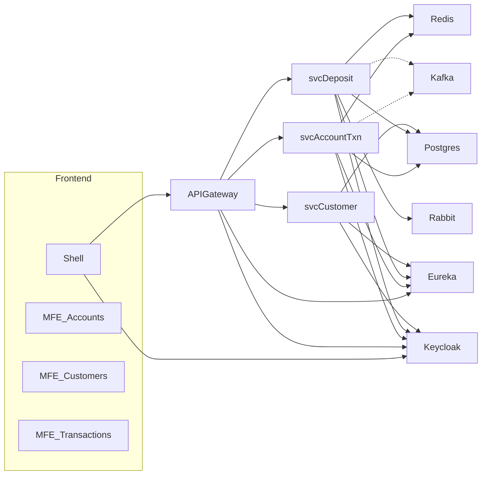
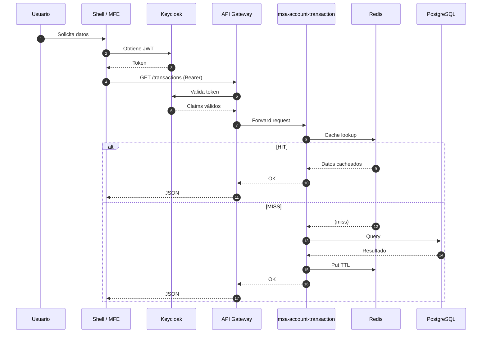

# Arquitectura de la Plataforma Financial Management

Este documento describe la arquitectura a nivel de contexto, contenedores y un flujo de interacción típico.

## Índice
1. Resumen
2. Componentes Principales
3. Diagrama de Contenedores (Mermaid)
4. Diagrama C4 (PlantUML)
5. Diagrama de Secuencia (Mermaid)
6. Integraciones y Consideraciones Técnicas
7. Extensiones Futuras
8. Cómo Renderizar los Diagramas

---
## 1. Resumen
La plataforma está compuesta por microservicios Spring Boot (Java 17) organizados bajo arquitectura Hexagonal + DDD, orquestados mediante un API Gateway y registrados en Eureka. La autenticación y emisión de tokens se gestiona con Keycloak. Los microfrontends Angular consumen los servicios vía Gateway.

## 2. Componentes Principales
| Categoría | Componente | Rol |
|-----------|-----------|-----|
| Frontend | Shell Microfrontend | Orquesta carga dinámica de MFEs |
| Frontend | MF Accounts / Customers / Transactions | Funcionalidad UI modular |
| Edge | API Gateway (`msa-gateway`) | Routing, filtros, seguridad, agregación |
| Service Discovery | Eureka (`msa-eureka`) | Registro y descubrimiento |
| Seguridad | Keycloak | OAuth2 / OIDC / JWT |
| Servicios de Dominio | `msa-account-transaction` | Transacciones de cuentas |
| Servicios de Dominio | `msa-deposit-account` | Operaciones cuentas depósito |
| Servicios de Dominio | `msa-customer-profiles` | Perfiles y datos de clientes |
| Datos | PostgreSQL | Persistencia relacional |
| Cache | Redis | TTL y performance |
| Mensajería (Opc) | RabbitMQ | Integraciones async internas |
| Streaming (Opc) | Kafka (Confluent Cloud) | Eventos dominio / auditoría |

## 3. Diagrama de Contenedores (Mermaid)


Versión completa: ver `architecture.mmd`.

## 4. Diagrama C4 (PlantUML)
Archivo: `architecture.puml`

Render rápido (online):
```
https://www.plantuml.com/plantuml/uml/<ENCODED>
```
Para obtener `<ENCODED>` usar PlantUML jar o extensiones (VS Code PlantUML / IntelliJ). 

## 5. Diagrama de Secuencia (Mermaid)


## 6. Integraciones y Consideraciones Técnicas
- Seguridad: JWT validado en Gateway y servicios (Resource Server).
- Descubrimiento: Eureka provee ubicación dinámica; Gateway puede usarlo para routing.
- Caché: Redis principal para respuestas y datos de referencia (config TTL desde YAML).
- Persistencia: Un único schema lógico (o varios schemata) en PostgreSQL. Para aislar dominios se puede migrar a múltiples bases.
- Eventos: Kafka sólo configurado para producir (Confluent Cloud). Para entorno local se sugiere stack `bitnami/kafka`.
- Mensajería interna: RabbitMQ opcional para futuros patrones (event-driven / integration events).

## 7. Extensiones Futuras
| Mejora | Descripción |
|--------|-------------|
| Circuit Breakers | Añadir Resilience4j en llamadas Feign |
| Observabilidad | Prometheus + Grafana / OpenTelemetry tracing |
| API Composition | BFF específico para UI complejas |
| Seguridad avanzada | Rotación de secrets, mTLS interno |
| Multi-tenant | Estrategia de partición por schema o base |
| Infra IaC | Terraform/Ansible para reproducibilidad |

## 8. Cómo Renderizar los Diagramas
- Mermaid: GitHub los renderiza automáticamente en Markdown (ext .md). VS Code: extensión "Markdown Preview Mermaid Support".
- PlantUML:
  1. Instalar Java + `plantuml.jar`.
  2. Ejecutar: `java -jar plantuml.jar docs/architecture.puml`.
  3. Salida: `architecture.png` / `architecture.svg`.
- Secuencia: Igual que Mermaid container.

---
¿Requieres también un diagrama de despliegue (Deployment) o modelo de dominio? Solicítalo y lo añadimos.
